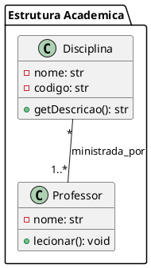

# PlantUML to Python Converter

Ferramenta completa para converter diagramas de classe PlantUML em código Python estruturado, com interface desktop moderna (PyWebView + HTML/Tailwind), histórico de conversões, explorador de arquivos e integração total entre front-end e back-end.

---

## Sumário
- [Visão Geral](#visão-geral)
- [Como Funciona (Visão do Usuário)](#como-funciona-visão-do-usuário)
- [Fluxo de Dados (Detalhamento Técnico)](#fluxo-de-dados-detalhamento-técnico)
- [Estrutura do Projeto](#estrutura-do-projeto)
- [Detalhamento das Pastas Principais](#detalhamento-das-pastas-principais)
- [Como Usar](#como-usar)
- [Exemplo de Diagrama PlantUML Suportado](#exemplo-de-diagrama-plantuml-suportado)
- [Exemplo de Estrutura Gerada](#exemplo-de-estrutura-gerada)
- [Logs e Tratamento de Erros](#logs-e-tratamento-de-erros)
- [Boas Práticas](#boas-práticas)
- [Dúvidas Frequentes](#dúvidas-frequentes)
- [Licença](#licença)

---

## Visão Geral

Este projeto permite que você:
- Cole ou importe diagramas PlantUML via interface gráfica ou CLI.
- Converta automaticamente para código Python, com estrutura de pacotes, enums, interfaces e relacionamentos.
- Navegue pelo histórico de conversões e explore os arquivos gerados de forma visual.
- Tenha logs detalhados e tratamento de erros amigável.

---

## Como Funciona (Visão do Usuário)

1. Você cola ou importa um diagrama PlantUML na interface gráfica, ou executa a conversão via linha de comando.
2. O sistema extrai automaticamente o nome do diagrama e gera uma pasta exclusiva para ele.
3. O código Python é gerado e salvo, junto com o diagrama original e um arquivo de relacionamentos.
4. Você pode navegar pelo histórico de conversões, visualizar e copiar qualquer arquivo gerado pela interface.
5. Mensagens de erro e logs são exibidos de forma clara, facilitando o uso mesmo para quem não é desenvolvedor.

---

## Fluxo de Dados (Detalhamento Técnico)

1. **Entrada do Diagrama**
   - Usuário fornece o PlantUML (GUI ou CLI). Nome extraído da linha `@startuml`.
2. **Parsing**
   - `lexer.py` tokeniza o texto; `parser.py` constrói objetos Python para cada elemento UML.
3. **Geração de Código**
   - `main_generator.py` cria arquivos `.py` e estrutura de pacotes, usando utilitários e mapeadores de tipo.
   - Imports e relacionamentos são resolvidos automaticamente.
   - Tudo é salvo em `data/output_generated_code/NOME_DIAGRAMA/`.
4. **Histórico e Navegação**
   - Frontend lê o diretório de saída, exibe todos os diagramas e arquivos gerados.
   - Navegação, visualização e cópia são feitas via interface moderna.
5. **Logs e Erros**
   - Backend gera logs detalhados; erros são tratados e exibidos ao usuário.

---

## Estrutura do Projeto

```text
PlantUMLToPythonConverter/
├── app.py                  # Interface desktop (PyWebView)
├── back_end/               # Backend: parser, gerador, CLI
│   ├── main_cli.py         # CLI para conversão
│   ├── plantuml_parser/    # Parser PlantUML e estruturas de dados
│   │   ├── parser.py, lexer.py
│   │   └── data_structures/ (classes para cada elemento UML)
│   └── python_generator/   # Geração de código Python
│       ├── main_generator.py, utils.py, type_mapper.py, import_manager.py
│       └── structure_generators/ (geradores para classes, enums, interfaces)
├── converter.py            # Script de conversão CLI
├── data/
│   ├── diagramas/          # Diagramas PlantUML de entrada (armazenados ao converter)
│   └── output_generated_code/ # Código Python gerado, um diretório por diagrama
├── front_end/              # HTML, CSS (Tailwind), JS da interface
│   ├── interface.html, style.css, main.js
├── main_app.py             # (Opcional) Script auxiliar
├── requirements.txt        # Dependências Python
├── package.json            # Dependências Node/Tailwind (dev)
├── README.md
├── explicacao_diretorio.txt# Explicação detalhada da estrutura
└── tests/                  # Estrutura para testes (backend, frontend, gerador)
```

---

## Detalhamento das Pastas Principais

- **back_end/**: Núcleo do conversor. Contém o parser PlantUML, estruturas de dados intermediárias e o gerador de código Python. Modularizado para fácil manutenção e expansão.
- **front_end/**: Interface gráfica separada, com HTML, CSS (Tailwind) e JS. Permite fácil customização visual e integração com PyWebView.
- **data/diagramas/**: Onde os arquivos PlantUML de entrada são salvos automaticamente ao converter.
- **data/output_generated_code/**: Saída do código Python, organizada por diagrama. Cada pasta contém todos os arquivos `.py`, o `.plantuml` original e o arquivo de relacionamentos.
- **tests/**: Estrutura pronta para testes automatizados.

---

## Como Usar

### Interface Gráfica (GUI)

1. Execute:

   ```bash
   python app.py
   ```

2. Cole ou importe seu diagrama PlantUML.
3. Clique em "Converter". O código será gerado e salvo automaticamente.
4. Use o explorador de arquivos para navegar pelo histórico e visualizar os arquivos gerados.

### Linha de Comando (CLI)

1. Para converter via terminal:

   ```bash
   python converter.py <caminho_para_seu_diagrama.plantuml> <diretorio_de_saida>
   ```

   ou

   ```bash
   python back_end/main_cli.py <caminho_para_seu_diagrama.plantuml> <diretorio_de_saida>
   ```

2. O código será salvo em `data/output_generated_code/NOME_DIAGRAMA/`.

---

## Exemplo de Diagrama PlantUML Suportado



---

## Exemplo de Estrutura Gerada

```text
data/output_generated_code/SistemaAcademicoComplexo/
├── __init__.py
├── SistemaAcademicoComplexo.plantuml
├── _diagram_relationships.txt
├── disciplina.py
├── professor.py
└── estrutura_academica/
    ├── __init__.py
    └── ...
```

---

## Logs e Tratamento de Erros

- O backend gera logs detalhados para cada etapa (parsing, geração, salvamento), facilitando o troubleshooting.
- Qualquer erro de sintaxe ou estrutura no PlantUML é exibido de forma clara na interface, sem travar o app.

---

## Boas Práticas

- Não versionar arquivos de saída, ambientes virtuais, node_modules, arquivos temporários ou de IDE (veja `.gitignore`).
- Use sempre a interface gráfica para melhor experiência e histórico.
- Mantenha seus diagramas organizados em `data/diagramas/`.
- Consulte o histórico para reusar ou revisar conversões anteriores.
- Consulte `explicacao_diretorio.txt` para detalhes da estrutura interna.
- **Frontend:** Node.js/Tailwind só é necessário para desenvolvimento do CSS. Para rodar o app, basta Python.

---

## Dúvidas Frequentes

- **Como o nome da pasta de saída é definido?**
  - É extraído da linha `@startuml NomeDoDiagrama` do seu arquivo PlantUML. Se já existir, será incrementado automaticamente.
- **Posso editar os arquivos gerados?**
  - Sim, mas recomenda-se manter o original para referência.
- **O que acontece se o diagrama estiver com erro?**
  - O sistema exibe mensagens claras no frontend e logs detalhados no backend.
- **Posso rodar testes automatizados?**
  - Sim, a estrutura de testes está pronta. Basta adicionar seus testes em `tests/` e rodar com `pytest` ou similar.

---

## Licença

MIT
