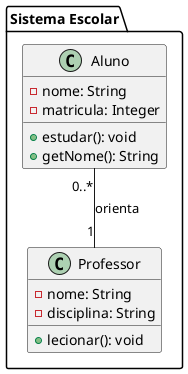

# PlantUML to Python Converter

Este projeto é uma ferramenta de linha de comando (CLI) projetada para converter diagramas de classe PlantUML em código Python estruturado. Ele analisa a sintaxe do PlantUML para classes, enums, interfaces, atributos, métodos e relacionamentos, e então gera os arquivos `.py` correspondentes, organizados em pacotes conforme definido no diagrama.

## Funcionalidades

* **Parsing de Diagramas de Classe PlantUML:** Interpreta a sintaxe de diagramas de classe PlantUML, incluindo:
    * Classes, Enums e Interfaces.
    * Atributos com tipos e visibilidade.
    * Métodos com parâmetros, tipos de retorno e visibilidade.
    * Pacotes e subpacotes.
* **Geração de Código Python:** Cria arquivos Python (`.py`) que refletem a estrutura do diagrama:
    * Classes Python com construtores, atributos e métodos.
    * Enums Python.
    * Interfaces Python (usando `abc.ABC` e `@abstractmethod`).
    * Mapeamento de tipos PlantUML para tipos Python e anotações de tipo.
* **Estrutura de Diretórios:** Organiza o código gerado em diretórios que espelham os pacotes definidos no PlantUML, incluindo arquivos `__init__.py`.
* **Gerenciamento de Relacionamentos:** Identifica relacionamentos (herança, implementação, associação, agregação, composição) e os documenta em um arquivo de texto (`_diagram_relationships.txt`) dentro do diretório de saída de cada diagrama. As importações necessárias para herança e tipos de atributos/parâmetros são gerenciadas.
* **Interface de Linha de Comando (CLI):** Fácil de usar através de comandos no terminal, permitindo especificar o arquivo de entrada PlantUML e o diretório de saída.
* **Configurável:** Permite ao usuário definir onde o código gerado será salvo.

## Pré-requisitos

* Python 3.7 ou superior. Nenhuma biblioteca externa é necessária para a execução básica, conforme o arquivo `requirements.txt` atual.

## Instalação

1.  Clone este repositório:
    ```bash
    git clone <URL_DO_SEU_REPOSITORIO>
    cd PlantUMLToPythonConverter
    ```
2.  Nenhuma instalação de dependências adicionais é necessária no momento.

## Uso

Você pode executar o conversor usando o script principal `converter.py` ou diretamente o `main_cli.py`.

**Opção 1: Usando `converter.py`**

Execute o script fornecendo o caminho do arquivo PlantUML de entrada e o diretório de saída:

```bash
python converter.py <caminho_para_seu_diagrama.plantuml> <diretorio_de_saida>
```

Se os argumentos não forem fornecidos, o script solicitará que você os insira:

```bash
python converter.py
Por favor, insira o caminho para o arquivo .plantuml de entrada:  # ex: input_diagrams/meu_diagrama.plantuml
Por favor, insira o diretório de saída para o código Python:      # ex: output_generated_code/meu_diagrama_convertido
```

**Opção 2: Usando `main_cli.py` diretamente**

```bash
python back_end/main_cli.py <caminho_para_seu_diagrama.plantuml> <diretorio_de_saida>
```

### Arquivo de Entrada PlantUML

* Crie seu diagrama de classes usando a sintaxe PlantUML e salve-o em um arquivo (por exemplo, `meu_diagrama.plantuml`).
* Recomenda-se criar um diretório como `input_diagrams/` para armazenar seus arquivos PlantUML.

Exemplo de um arquivo PlantUML simples (`input_diagrams/exemplo_simples.plantuml`):



### Saída Gerada

O conversor irá gerar:

* Arquivos `.py` para cada classe, enum e interface no diretório de saída especificado.
* Subdiretórios correspondentes aos pacotes definidos no PlantUML.
* Arquivos `__init__.py` em cada subdiretório de pacote para permitir que sejam tratados como módulos Python.
* Um arquivo `_diagram_relationships.txt` no diretório raiz do diagrama gerado, listando os relacionamentos detectados.

Por exemplo, se o diretório de saída for `output_generated_code/meu_projeto`, a estrutura de saída para o exemplo acima poderia ser:

```
output_generated_code/meu_projeto/
├── sistema_escolar/
│   ├── __init__.py
│   ├── aluno.py
│   └── professor.py
├── __init__.py
└── _diagram_relationships.txt
```

## Estrutura do Diretório do Projeto

```
PlantUMLToPythonConverter/
├── back_end/
│   ├── __init__.py
│   ├── main_cli.py                 # Lógica principal da interface de linha de comando (CLI)
│   ├── plantuml_parser/
│   │   ├── __init__.py
│   │   ├── lexer.py                # Analisador léxico para tokens PlantUML
│   │   ├── parser.py               # Analisador sintático para a estrutura do PlantUML
│   │   └── data_structures/        # Estruturas de dados para representar elementos PlantUML
│   │       ├── __init__.py
│   │       ├── plantuml_atributo.py
│   │       ├── plantuml_classe.py
│   │       ├── plantuml_diagrama.py
│   │       ├── plantuml_enum.py
│   │       ├── plantuml_estrutura_base.py
│   │       ├── plantuml_interface.py
│   │       ├── plantuml_metodo.py
│   │       ├── plantuml_pacote.py
│   │       ├── plantuml_parametro.py
│   │       └── plantuml_relacionamento.py
│   └── python_generator/
│       ├── __init__.py
│       ├── import_manager.py       # Gerencia as importações nos arquivos Python gerados
│       ├── main_generator.py       # Orquestra a geração de código Python
│       ├── type_mapper.py          # Mapeia tipos PlantUML para tipos Python
│       ├── utils.py                # Funções utilitárias para geração de código
│       └── structure_generators/   # Geradores para estruturas específicas (classes, enums, etc.)
│           ├── __init__.py
│           ├── class_generator.py
│           ├── enum_generator.py
│           └── interface_generator.py
├── converter.py                    # Ponto de entrada principal do script/aplicação
├── input_diagrams/                 # (Sugestão) Diretório para colocar arquivos .plantuml de entrada
│   └── exemplo_simples.plantuml    # (Sugestão) Arquivo de exemplo PlantUML
├── output_generated_code/          # Diretório padrão onde o código Python gerado é salvo
│   └── ...                         # Outros diagramas processados
├── README.md                       # Este arquivo
├── requirements.txt                # Lista de dependências Python (atualmente vazia)
└── explicacao_diretorio.txt        # Arquivo que detalha a estrutura de diretórios
```
